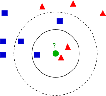

# Training KNN for Classification of Hand Gesture


> Where There Is Python There Is A Way 😜

---

### Table of Contents
<!-- You're sections headers will be used to reference location of destination. -->

- [Description](#description)
- [How To Use](#how-to-use)
- [References](#references)
- [License](#license)
- [Author Info](#author-info)

---

## **Description**

This Repo is mainly provided for training of the KNN model for hand gesture.As KNN is simple and efficent machine learning algorithm

<font size="4"> **Some Information about KNN**</font>

K-NN is a type of classification where the function is only approximated locally and all computation is deferred until function evaluation. Since this algorithm relies on distance for classification, if the features represent different physical units or come in vastly different scales then normalizing the training data can improve its accuracy dramatically.

**Example**

Example of k-NN classification. The test sample (green dot) should be classified either to blue squares or to red triangles. If k = 3 (solid line circle) it is assigned to the red triangles because there are 2 triangles and only 1 square inside the inner circle. If k = 5 (dashed line circle) it is assigned to the blue squares (3 squares vs. 2 triangles inside the outer circle).

<center>



</center>

#### **Technologies**

- Python
- MediaPipe
- Sklearn


[Back To The Top](#read-me-template)

---

## How To Use

#### **Main Installation**

```html
    > git clone https://github.com/ReTrO19/Training-KNN-For-Hand-Gesture.git
    > cd Training-KNN-For-Hand-Gesture
    > python -m venv knn_train_venv
    > knn_train_venv\Scripts\activate
    > pip install -r requirements.txt
```

---
## How generate data

#### **Step 1: Recording Video**
```html
    > python record_class_video.py
    > Enter Class : < Enter the class name >
```
#### **Step 2: Convert the Video to Frames**
```html
    > python video_to_images.py
```

#### **Step 3: Convert the Images to features and store it in csv for training**
```html
    > python data_creation.py
```
#### **Final Step: Training the model for provided data**
```html
    > python train.py
```
#### ( After the model training  pickle file will be generated which can later be used for inference )
[Back To The Top](#read-me-template)

---

## References

MediaPipe offers cross-platform, customizable ML solutions for live and streaming media.
[MediaPipe](https://google.github.io/mediapipe/solutions/hands.html)

[Back To The Top](#read-me-template)

---

## License

MIT License

Copyright (c) [2021] [Abhishek Khamkar]

Permission is hereby granted, free of charge, to any person obtaining a copy
of this software and associated documentation files (the "Software"), to deal
in the Software without restriction, including without limitation the rights
to use, copy, modify, merge, publish, distribute, sublicense, and/or sell
copies of the Software, and to permit persons to whom the Software is
furnished to do so, subject to the following conditions:

The above copyright notice and this permission notice shall be included in all
copies or substantial portions of the Software.

THE SOFTWARE IS PROVIDED "AS IS", WITHOUT WARRANTY OF ANY KIND, EXPRESS OR
IMPLIED, INCLUDING BUT NOT LIMITED TO THE WARRANTIES OF MERCHANTABILITY,
FITNESS FOR A PARTICULAR PURPOSE AND NONINFRINGEMENT. IN NO EVENT SHALL THE
AUTHORS OR COPYRIGHT HOLDERS BE LIABLE FOR ANY CLAIM, DAMAGES OR OTHER
LIABILITY, WHETHER IN AN ACTION OF CONTRACT, TORT OR OTHERWISE, ARISING FROM,
OUT OF OR IN CONNECTION WITH THE SOFTWARE OR THE USE OR OTHER DEALINGS IN THE
SOFTWARE.

[Back To The Top](#read-me-template)

---

## Author Info

- LinkedIn - [Abhishek Khamkar](https://www.linkedin.com/in/abhishek-khamkar-b30756185)


[Back To The Top](#read-me-template)
